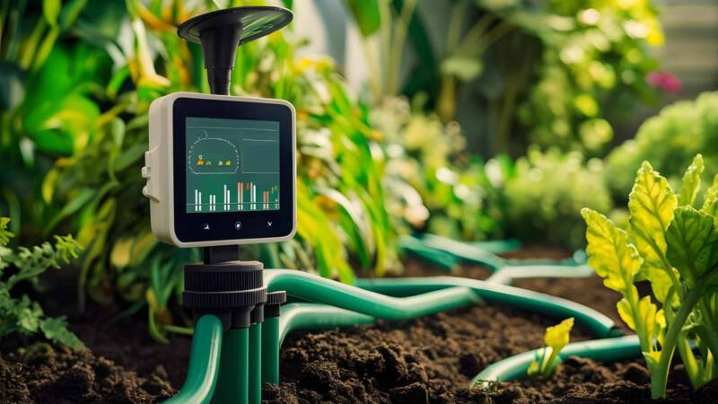

```markdown

A smart IoT project using ESP32, DHT11, Soil Moisture, and Water Level Sensors, all connected with the Blynk IoT platform to monitor and automate agricultural environments.

## 🧭 Project Overview
```mermaid
graph TD
    A[ESP32] -->|WiFi| B[Blynk Cloud]
    A --> C[Temperature & Humidity Sensor (DHT11)]
    A --> D[Soil Moisture Sensor]
    A --> E[Water Level Sensor]
    A --> F[Relay Module (Pump Control)]
    B --> G[Mobile App Dashboard]
    G -->|Manual Control| F
```
# 🌿 Smart Agriculture Monitoring System


## 📦 Features
- 🌡️ Real-time temperature & humidity tracking
- 🌱 Soil moisture monitoring and alerts
- 💧 Water level measurement
- 🔁 Auto pump control based on moisture level
- 📲 Integrated with Blynk for mobile control
- 🔔 Smart event notifications
- 🛠️ Hardware Configuration (Dynamic Pin Setup)

## 🛠️ Hardware Configuration

| Sensor / Module       | Description                 | Pin Configuration |
|-----------------------|-----------------------------|-------------------|
| Soil Moisture         | Analog Sensor               | GPIO 32           |
| DHT11                 | Temp & Humidity Sensor      | GPIO 4            |
| Water Level Sensor    | Signal & Power control      | GPIO 36 / GPIO 17 |
| Relay Module          | Controls Pump               | GPIO 26           |

✅ You can change pin assignments at the top of the code without touching the logic.

## 🔁 Data Flow & Control
- Sensors read environmental values every 2 seconds
- Data is pushed to Blynk virtual pins (V0-V4)
- Notifications sent if:
  - Temperature > 30°C
  - Humidity > 60%
  - Moisture < 30%
  - Water Level < 30%
- If moisture ≥ 75%, pump is automatically turned off
- Users can manually control the pump via mobile app (V4)

## 🧾 Blynk Virtual Pins Overview

| Virtual Pin | Purpose               | Value Type |
|-------------|-----------------------|------------|
| V0          | Temperature (°C)      | Float      |
| V1          | Humidity (%)          | Float      |
| V2          | Soil Moisture (%)     | Integer    |
| V3          | Water Level (%)       | Float      |
| V4          | Relay ON/OFF          | Boolean    |

## 🧰 Setup Instructions
1. Clone or download this repo.
2. Open the .ino file in Arduino IDE.
3. Change these lines:
   ```cpp
   char ssid[] = "your_wifi_name";
   char pass[] = "your_wifi_password";
   ```
4. Upload to your ESP32.
5. Open Blynk App, set up virtual widgets (V0-V4).
6. Watch your farm become smart! 🌾

## 📚 References
- [ESP32 Blynk Docs](https://docs.blynk.io/)
- [Adafruit DHT11 Library](https://github.com/adafruit/DHT-sensor-library)
- [ESP32 Board on Arduino](https://github.com/espressif/arduino-esp32)

## 👨‍🔬 Author
Developed by **Rakib Hassan**  
🚀 GitHub: [Deadbrat](https://github.com/rakibhassanrh66)  
🔐 Cybersecurity Enthusiast | IoT Builder | Innovation Seeker  

💬 *"Empowering agriculture through automation & intelligence."*
```
